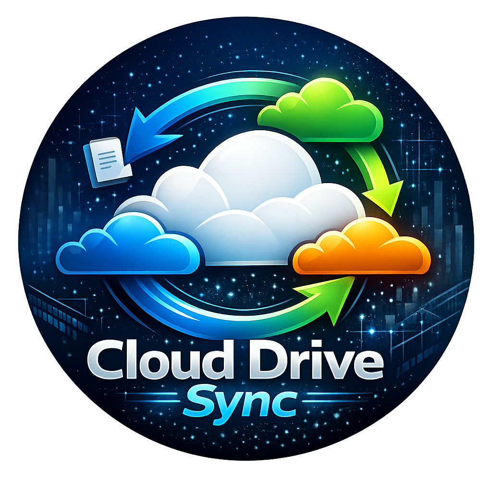

# Cloud Drive Sync



A lightweight PowerShell script that bidirectionally syncs files between any two local folders— originally built for OneDrive ↔ iCloud Drive on Windows, but works on any OS (Windows, macOS, Linux) with any cloud storage that syncs to a local folder (Google Drive, Dropbox, Box, etc.).

## What It Does

- **Bidirectional sync** — new and updated files sync both directions (newest timestamp wins on conflicts)
- **One-way deletes** — deletions only propagate from Side A (primary) to Side B (secondary), not the reverse. If you delete from Side B, the file stays on Side A and gets re-synced back. This was the preferred behavior of the original developer — feel free to modify the script to make deletes bidirectional if that suits your needs.
- **File type filtering** — only syncs specified file types (`.docx`, `.pdf`, `.jpg`, etc.) and logs any skipped files. To add more file types, update the `$IncludeExtensions` array near the top of `Sync-CloudDrives.ps1`.
- **Smart state tracking** — uses a JSON state file to distinguish "deleted from primary" vs. "new file not yet synced"
- **Cloud offload protection** — if a cloud provider offloads all files to placeholders (0 files visible), deletions are automatically skipped to prevent data loss
- **JSON logging** — every action (NEW, UPDATED, DELETED, SKIPPED, ERROR) is logged with timestamps

## Prerequisites

- **Windows 10/11, macOS, or Linux**

## Dependencies

The script syncs between two local folders — it does not use cloud APIs directly. As long as your cloud storage provider creates a local sync folder on your machine, this script will work with it.

**Downloads:**

| Application | Required? | Download |
|-------------|-----------|----------|
| **PowerShell 7+** | Required | [Download PowerShell](https://github.com/PowerShell/PowerShell/releases/latest) |
| **OneDrive** | Optional | [Download OneDrive](https://www.microsoft.com/en-us/microsoft-365/onedrive/download) |
| **iCloud** | Optional | [Download iCloud for Windows](https://apps.microsoft.com/detail/9PKTQ5699M62) |
| **Google Drive** | Optional | [Download Google Drive](https://www.google.com/drive/download/) |
| **Dropbox** | Optional | [Download Dropbox](https://www.dropbox.com/install) |
| **Box Drive** | Optional | [Download Box Drive](https://www.box.com/resources/downloads) |

> **Note:** PowerShell 7 is required. On Windows, install the MSI version (not the Store version) for Task Scheduler compatibility. For cloud storage, you only need any two installed — whichever pair you want to sync between.

Each cloud storage app creates a local folder on your machine where it syncs files. When configuring the script, you'll point `$SideA` and `$SideB` to these local folders. Check each app's settings to find the exact path — it varies by OS and how the app was installed. You don't have to sync the entire cloud drive — you can point Side A and Side B to any specific subfolder you want. For example, you might sync just a single "Projects" folder between OneDrive and iCloud rather than everything at the root.

## Setup

### 1. Configure the script

Open `Sync-CloudDrives.ps1` and update the configuration section at the top:

```powershell
# Windows
$SideA = "C:\Users\YourName\OneDrive\Documents\MyFolder"

# macOS
$SideA = "/Users/YourName/Library/CloudStorage/OneDrive-Personal/MyFolder"

# Linux
$SideA = "/home/YourName/OneDrive/MyFolder"
```

```powershell
# Windows
$SideB = "C:\Users\YourName\iCloudDrive\MyFolder"

# macOS (iCloud Drive is native)
$SideB = "/Users/YourName/Library/Mobile Documents/com~apple~CloudDocs/MyFolder"
```

```powershell
# Windows
$LogFile = "C:\Users\YourName\.sync-cloud-drives.json"
$StateFile = "C:\Users\YourName\.sync-cloud-drives-state.json"

# macOS / Linux
$LogFile = "/Users/YourName/.sync-cloud-drives.json"
$StateFile = "/Users/YourName/.sync-cloud-drives-state.json"
```

Optionally update the allowed file types:

```powershell
$IncludeExtensions = @(".docx", ".doc", ".pdf", ".jpg", ".jpeg", ".png", ".gif", ".bmp", ".tiff", ".heic")
```

### 2. Configure the VBS launcher (Windows only, optional — prevents window flash)

> **Note:** `RunSync.vbs` is a Windows-only wrapper. It uses VBScript to launch PowerShell completely hidden. On macOS or Linux, this file is not needed — just call the script directly from your scheduler.

Open `RunSync.vbs` and replace the placeholders:

```
<PWSH_PATH>   → C:\Program Files\PowerShell\7\pwsh.exe
<SCRIPT_PATH> → C:\path\to\Sync-CloudDrives.ps1
```

### 3. Test it

Run the script manually first to verify it works:

```powershell
# Windows
& "C:\Program Files\PowerShell\7\pwsh.exe" -ExecutionPolicy Bypass -File "C:\path\to\Sync-CloudDrives.ps1"

# macOS / Linux
pwsh -File /path/to/Sync-CloudDrives.ps1
```

### 4. Schedule it

This script was originally developed on Windows using Task Scheduler, but it can be scheduled with any task runner on any OS that supports PowerShell 7.

#### Windows — Task Scheduler

Open **Task Scheduler** → **Create Task** (not "Create Basic Task"):

| Tab | Setting |
|-----|---------|
| **General** | Name: `CloudDriveSync` — Check "Run only when user is logged on" — Check "Hidden" |
| **Triggers** | Daily, recur every 1 day — Repeat every **15 minutes** for **Indefinitely** |
| **Actions** | Program: `wscript.exe` — Arguments: `"C:\path\to\RunSync.vbs"` |

> **Note:** "Run only when user is logged on" includes locked screen sessions — the task will fire as long as your Windows session is active.

> **Why the VBS wrapper?** Task Scheduler + PowerShell always flashes a console window briefly. The VBS wrapper launches PowerShell completely hidden.

#### macOS — launchd

Create a plist file at `~/Library/LaunchAgents/com.user.clouddrivesync.plist` that runs the script every 15 minutes:

```bash
# Quick test
pwsh -File /path/to/Sync-CloudDrives.ps1

# Load the scheduled job
launchctl load ~/Library/LaunchAgents/com.user.clouddrivesync.plist
```

#### Linux — cron

Add a cron entry to run every 15 minutes:

```bash
crontab -e

# Add this line:
*/15 * * * * pwsh -File /path/to/Sync-CloudDrives.ps1 >> /var/log/clouddrivesync.log 2>&1
```

## Files

| File | Purpose |
|------|---------|
| `Sync-CloudDrives.ps1` | Main sync script |
| `RunSync.vbs` | Silent launcher wrapper for Task Scheduler — **Windows only** (prevents window flash) |

## Generated Files (created at runtime)

| File | Purpose |
|------|---------|
| `~\.sync-cloud-drives.json` | JSON log — one entry per action (NEW, UPDATED, DELETED, SKIPPED, ERROR) |
| `~\.sync-cloud-drives-state.json` | State file — tracks known synced files for deletion logic |

## Sync Behavior

| Scenario | What Happens |
|----------|-------------|
| New file on Side A | Copied to Side B |
| New file on Side B | Copied to Side A |
| File edited on Side A | Updated on Side B (if newer) |
| File edited on Side B | Updated on Side A (if newer) |
| File edited on both sides | Newest timestamp wins |
| File deleted from Side A | Deleted from Side B |
| File deleted from Side B | Stays on Side A, re-synced back to Side B |
| File deleted from both sides | No action — silently ignored |
| Unsupported file type added | Logged as SKIPPED, not synced |
| Cloud provider offloads all files | Deletions skipped with warning (prevents data loss) |

## Known Limitations

- **File type filter** — only files matching `$IncludeExtensions` are synced. All others are logged as SKIPPED.
- **Subfolder sync** — syncs the configured folders recursively, including subfolders. The `test\` subfolder pattern from development is not excluded by default.
- **Task Scheduler + "Run whether logged on or not" (Windows)** — this option requires additional configuration with PowerShell 7 from the Windows Store. Use the MSI-installed version of PowerShell 7 or set to "Run only when user is logged on" for simplicity. This limitation does not apply to macOS (launchd) or Linux (cron).

## License

MIT — use it however you want.
